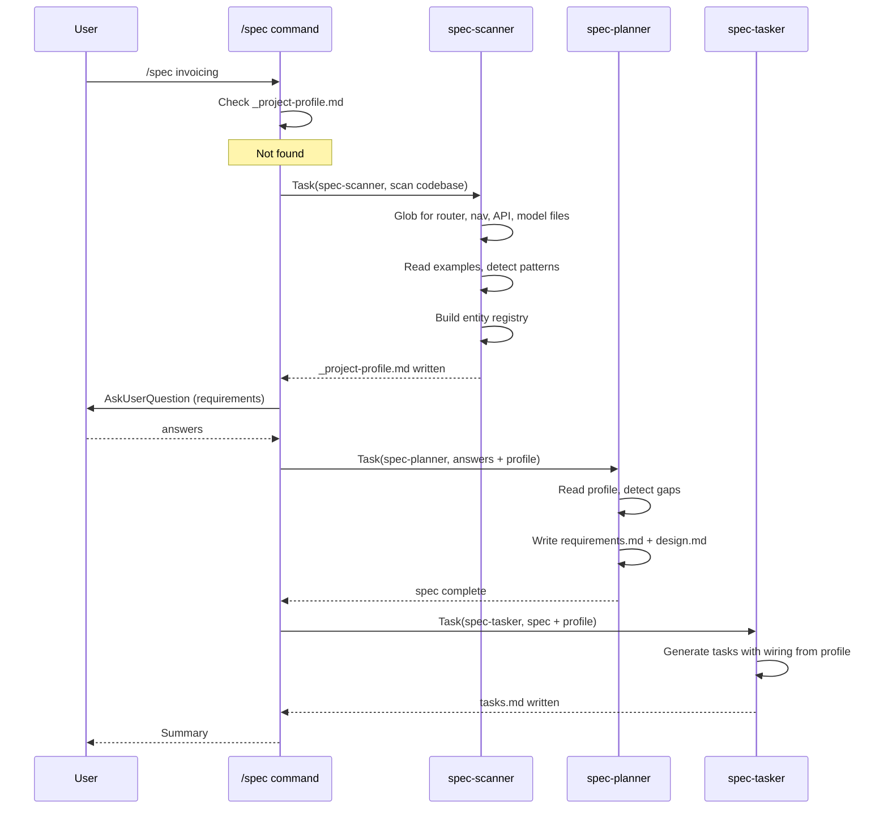
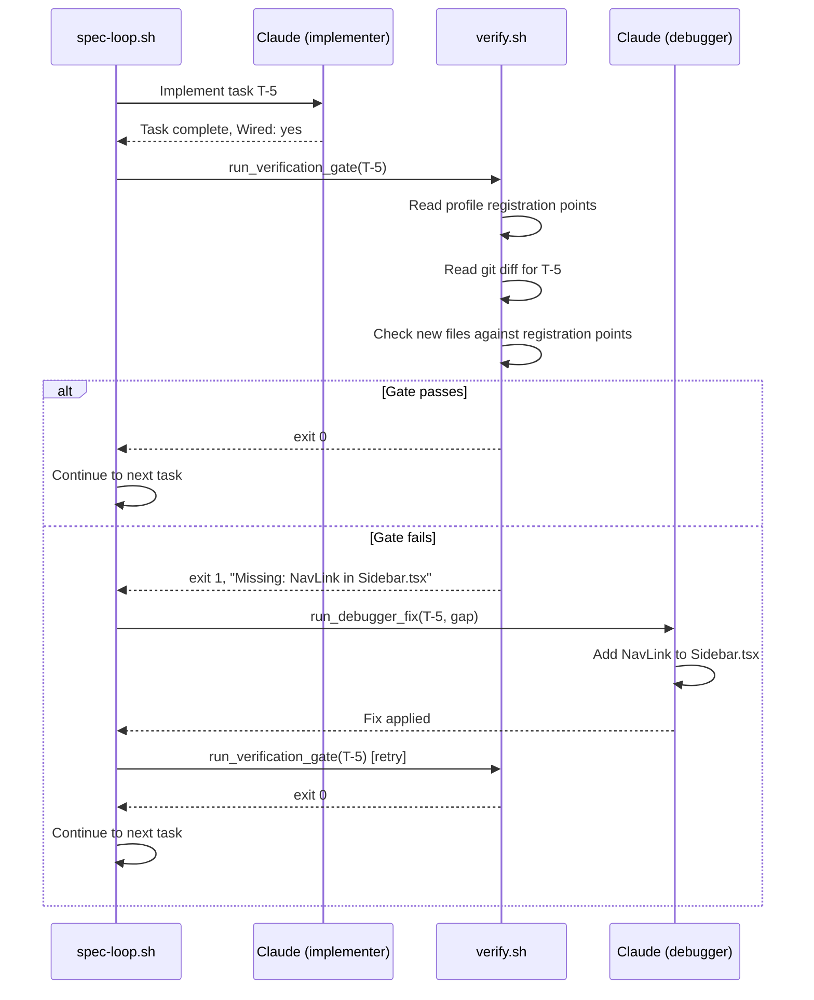
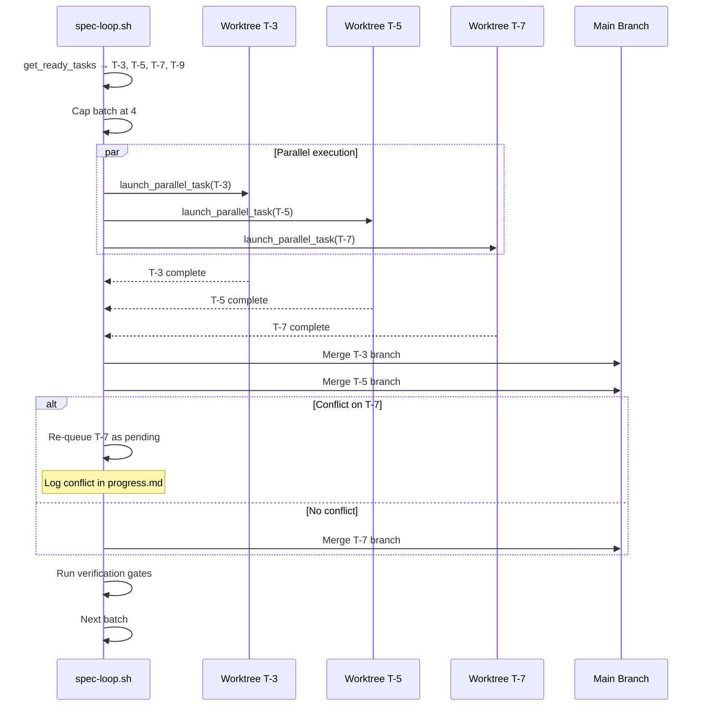

# Design: Spec Intelligence Layer

> Generated by spec-driven plugin

## Overview

This design introduces seven components into the spec-driven plugin: a new scanner agent and command, a persistent project profile, wiring-aware implementation via profile injection, verification gates in the execution loop, a standalone debug command, dependency-aware parallel execution, and regression markers. Each component integrates with the existing agent/command/script architecture.

---

## High-Level Architecture

```
                        ┌──────────────────────────────┐
                        │         User Commands         │
                        │  /spec  /spec-scan  /spec-debug│
                        └──────────┬───────────────────┘
                                   │
                    ┌──────────────┼──────────────────────┐
                    │              │                       │
              ┌─────▼─────┐ ┌─────▼──────┐  ┌────────────▼───┐
              │spec-scanner│ │ spec-planner│  │  spec-debugger │
              │  (new)     │ │ (modified)  │  │  (enhanced)    │
              └─────┬──────┘ └─────┬──────┘  └────────┬───────┘
                    │              │                    │
                    ▼              ▼                    ▼
         ┌─────────────────────────────────────────────────────┐
         │              .claude/specs/                          │
         │  _project-profile.md   <feature>/requirements.md    │
         │  _profile-index.md     <feature>/design.md          │
         │  _profile-<domain>.md  <feature>/tasks.md           │
         │                        debug-<slug>/diagnosis.md    │
         │                        debug-<slug>/fix.md          │
         └──────────────────────────┬──────────────────────────┘
                                    │
              ┌─────────────────────┼─────────────────────┐
              │                     │                      │
        ┌─────▼──────┐  ┌─────────▼────────┐  ┌──────────▼───┐
        │spec-        │  │  spec-loop.sh    │  │ spec-tester  │
        │implementer  │  │  (parallel +     │  │ (gate-aware) │
        │(profile-    │  │   gates)         │  │              │
        │ aware)      │  └──────────────────┘  └──────────────┘
        └─────────────┘
```

## Data Flow

```
1. /spec <name> (first run)
   ├── spec-scanner reads codebase → writes _project-profile.md
   ├── /spec command gathers requirements from user
   ├── spec-planner reads profile + user answers → writes requirements.md + design.md
   │   └── includes gap warnings from Entity Registry
   └── spec-tasker reads spec + profile → writes tasks.md
       └── includes prerequisite tasks for gaps

2. spec-loop.sh execution
   ├── Parse dependency graph from tasks.md
   ├── Identify ready batch (tasks with all deps completed)
   ├── FOR EACH batch (up to 4 parallel):
   │   ├── spec-implementer reads profile → implements task with specific wiring
   │   ├── VERIFICATION GATE: check registration points for new artifacts
   │   │   ├── PASS → mark task, continue
   │   │   └── FAIL → spawn spec-debugger → re-check → continue or escalate
   │   └── Update tasks.md, progress.md, git commit
   └── Repeat until all tasks complete

3. /spec-debug
   ├── User describes bug
   ├── spec-debugger investigates → writes diagnosis.md
   ├── spec-debugger fixes → writes fix.md
   ├── Append regression marker to _project-profile.md
   └── IF complex fix → auto-run /spec-retro
```

---

## Component Specifications

### C-1: spec-scanner Agent

**Purpose**: Scan a codebase using LLM-driven heuristics to detect framework, patterns, entities, and registration points.

**File**: `agents/spec-scanner.md`

**Model**: `claude-sonnet-4-6` (fast, reads many files; reasoning depth not critical here)

**Tools**: `Read`, `Glob`, `Grep`, `Write`

**Responsibilities**:
- Discover the project's technology stack by reading manifest files (package.json, go.mod, Cargo.toml, pyproject.toml, etc.)
- Identify how routes are registered by finding router configuration files and reading examples
- Identify how navigation works by finding nav/sidebar/menu components
- Identify where API endpoints are defined by finding server/handler files
- Identify database/ORM patterns by finding model/schema/migration files
- Build an entity registry by scanning for model definitions and their CRUD implementations
- Produce the project profile in the specified format

**Scan Strategy** (LLM-driven, not regex):
1. Read manifest files to identify framework (React, Next.js, Express, Django, Go+Chi, etc.)
2. Use `Glob` to find likely router files (`**/router.*`, `**/routes.*`, `**/app.*`, `**/*routes*`)
3. Read 2-3 router files and describe the pattern in natural language
4. Use `Glob` to find navigation components (`**/nav*`, `**/sidebar*`, `**/menu*`, `**/layout*`)
5. Read navigation files and describe how new links are added
6. Use `Glob` to find API handler files (`**/handler*`, `**/controller*`, `**/api/**`)
7. Read handler files and describe the endpoint registration pattern
8. Use `Glob` to find model/entity files (`**/model*`, `**/schema*`, `**/entity*`)
9. For each entity found, search for Create/Read/Update/Delete implementations
10. Compile findings into the three profile sections

**Confidence Heuristic**:
- Read N examples of a pattern. If N >= 3 and they are consistent: `high`. If N = 1-2: `medium`. If N = 0 (inferred from framework): `low`.

**Interfaces**:
- **Input**: Project root directory path (cwd)
- **Output**: `_project-profile.md` (or split files + `_profile-index.md`)
- **Triggers**: Called by `/spec` command (auto, first run) or `/spec-scan` command (explicit)

**Error Handling**:
- If no recognizable framework is detected, produce a minimal profile with `confidence: low` patterns and an empty Entity Registry. Log a warning suggesting `## Manual Overrides`.
- If file read fails (permission denied), skip that file and note it in the profile as "[skipped: permission denied]".

**Security**:
- Skip files matching: `*.env*`, `*.key`, `*.pem`, `*.secret`, `*credentials*`, and directories `.aws/`, `.gcp/`, `.ssh/`, `node_modules/`, `vendor/`, `.git/`

---

### C-2: Project Profile Format

**Purpose**: Persistent, structured knowledge about a project's wiring patterns, entities, and registration points.

**File Location**: `.claude/specs/_project-profile.md` (single app) or split files (monorepo/large app)

**Format**:

```markdown
# Project Profile

> Auto-generated by spec-scanner. Last updated: YYYY-MM-DD HH:MM

## Stack
- Framework: Next.js 14 (App Router)
- Language: TypeScript
- Backend: API routes in app/api/
- Database: Prisma + PostgreSQL
- Styling: Tailwind CSS

## Patterns

### Route Registration [confidence: high]
New pages are created as `app/<path>/page.tsx` files. The file-based router picks them up automatically. No manual route registration needed.

### Navigation [confidence: high]
The main navigation is in `src/components/Sidebar.tsx:23-45`. New nav links are added as `<NavLink>` elements inside the `<nav>` block. Each link has `href`, `icon`, and `label` props.

### API Endpoints [confidence: high]
API routes live in `app/api/<resource>/route.ts`. Each file exports named functions: `GET`, `POST`, `PUT`, `DELETE`. The file-based router handles registration.

### Database Models [confidence: medium]
Prisma schema is at `prisma/schema.prisma`. New models are added there and migrated with `npx prisma migrate dev`. The Prisma client is instantiated in `src/lib/prisma.ts:5`.

## Entity Registry

| Entity | Create | Read | Update | Delete | Notes |
|--------|--------|------|--------|--------|-------|
| User | yes | yes | yes | no | Missing soft-delete |
| Invoice | yes | yes | no | no | Read-only after creation |
| Product | yes | yes | yes | yes | Full CRUD |

## Registration Points

- `src/components/Sidebar.tsx:23` — Add `<NavLink>` for new pages
- `prisma/schema.prisma` — Add new Prisma models
- `src/lib/prisma.ts:5` — Prisma client singleton (no changes needed)
- `app/api/` — Create `<resource>/route.ts` for new API endpoints
- `app/` — Create `<path>/page.tsx` for new pages

## Regression Markers

(none)

## Manual Overrides

(user-editable — preserved across rescans)
```

**Split File Strategy**:
When a single profile exceeds 200 lines, create:
- `_profile-index.md`: Lists all domain files with one-line summaries
- `_profile-<domain>.md`: Each contains Stack (shared, repeated), Patterns (domain-specific), Entity Registry (domain entities), Registration Points (domain files)

Domains are inferred from directory structure (e.g., `src/auth/` -> auth domain, `src/billing/` -> billing domain) or by entity grouping if no clear directory structure exists.

---

### C-3: /spec-scan Command

**Purpose**: Explicitly trigger a full codebase scan and profile generation/update.

**File**: `commands/spec-scan.md`

**Allowed Tools**: `Read`, `Write`, `Glob`, `Grep`, `Task`, `AskUserQuestion`

**Behavior**:
1. Read existing `_project-profile.md` if it exists (preserve Manual Overrides and Regression Markers)
2. Invoke `spec-scanner` agent via Task tool
3. Merge new scan results with preserved sections
4. Write updated profile
5. Print summary: number of patterns detected, entities found, registration points mapped, confidence breakdown

---

### C-4: Modified /spec Command

**Purpose**: Integrate Phase 0 auto-scan into the existing /spec workflow.

**File**: `commands/spec.md` (modified)

**Changes**:
1. After creating the spec directory structure (step 1), before requirements gathering (step 2):
   - Check if `_project-profile.md` exists in `.claude/specs/`
   - If NOT: invoke spec-scanner agent, wait for profile to be written
   - If YES: read existing profile
2. Pass profile content to spec-planner agent alongside user answers
3. Pass profile content to spec-tasker agent for wiring-aware task generation
4. After tasker completes (new step 4.5): run the validate-fix loop (C-12) — invoke validator, auto-fix issues, re-validate up to 3 cycles

**Sequence Diagram**:

```
User              /spec command       spec-scanner     spec-planner     spec-tasker     spec-validator
 │                    │                    │                │                │                │
 │──/spec feature────>│                    │                │                │                │
 │                    │──check profile────>│                │                │                │
 │                    │  (not found)       │                │                │                │
 │                    │──invoke scanner───>│                │                │                │
 │                    │                    │──scan codebase │                │                │
 │                    │                    │──write profile │                │                │
 │                    │<──profile ready────│                │                │                │
 │                    │                    │                │                │                │
 │<──ask questions────│                    │                │                │                │
 │──answers──────────>│                    │                │                │                │
 │                    │──invoke planner────────────────────>│                │                │
 │                    │  (answers+profile)                  │                │                │
 │                    │                    │                │──write req+des │                │
 │                    │<──spec complete────────────────────│                │                │
 │                    │                    │                │                │                │
 │                    │──invoke tasker──────────────────────────────────────>│                │
 │                    │  (spec+profile)                                     │                │
 │                    │                    │                │                │──write tasks   │
 │                    │<──tasks complete────────────────────────────────────│                │
 │                    │                    │                │                │                │
 │                    │──validate-fix loop (max 3 cycles)───────────────────────────────────>│
 │                    │                    │                │                │                │──check spec
 │                    │                    │                │  ┌─fix req/des─│<──issues───────│
 │                    │                    │                │  └────────────>│                │
 │                    │                    │                │                │  ┌─fix tasks───│
 │                    │                    │                │                │  └────────────>│──re-validate
 │                    │<──validation done───────────────────────────────────────────────────│
 │<──summary──────────│                    │                │                │                │
```

---

### C-5: Modified spec-implementer Agent

**Purpose**: Use project-specific registration points for wiring instead of generic checklist.

**File**: `agents/spec-implementer.md` (modified)

**Changes**:
1. Add instruction at the top of the Implementation Process (before step 1): "Read the project profile at `.claude/specs/_project-profile.md` (or `_profile-index.md` if split). Use the Registration Points section to identify exactly where to wire new code."
2. Replace the generic wiring checklist (current lines 40-48) with a dynamic instruction: "For each new artifact you create, check the Registration Points in the project profile. Wire the artifact at the specific `file:line` locations listed. If the profile is missing or has no relevant registration point, fall back to the generic checklist below." Keep the generic checklist as a fallback block.
3. Add a profile-aware self-check step: "After wiring, read each registration point file you modified and verify the new artifact appears correctly."

---

### C-6: Modified spec-tester Agent

**Purpose**: Use profile registration points for integration checks instead of generic heuristics.

**File**: `agents/spec-tester.md` (modified)

**Changes**:
1. In Step 0 (Integration Check), add: "Read the project profile's Registration Points. For each new artifact created by the task, verify it appears at the expected registration point file:line."
2. The existing generic checks (lines 46-56) remain as fallback when no profile exists.

---

### C-7: Verification Gates in spec-loop.sh

**Purpose**: After each task completion, automatically verify wiring using project profile before proceeding.

**File**: `scripts/spec-loop.sh` (modified) + `scripts/lib/verify.sh` (new)

**verify.sh Functions**:

```bash
# run_verification_gate(spec_dir, task_id, work_dir)
# Reads the project profile and the task's changed files.
# For each new file/export, checks if it appears at the expected registration points.
# Returns 0 if all checks pass, 1 if wiring gaps found.
# Outputs the gap description to stdout on failure.
run_verification_gate() {
  local spec_dir="$1"
  local task_id="$2"
  local work_dir="$3"
  # Implementation: build a prompt with the profile's registration points
  # and the git diff for the current task, ask Claude to verify wiring.
  # Uses a lightweight claude invocation (short prompt, fast model).
}

# run_debugger_fix(spec_dir, task_id, gap_description, work_dir)
# Spawns the spec-debugger to fix a specific wiring gap.
# Returns 0 if fix was applied, 1 if debugger failed.
run_debugger_fix() {
  local spec_dir="$1"
  local task_id="$2"
  local gap_description="$3"
  local work_dir="$4"
  # Implementation: invoke claude with debugger prompt + gap info
}
```

**Integration into spec-loop.sh**:

After the main Claude invocation completes each iteration (after line 261), insert:

```bash
# Verification gate
if [ -f "$SPEC_DIR/../_project-profile.md" ] || [ -f "$SPEC_DIR/../_profile-index.md" ]; then
  COMPLETED_TASK=$(extract_last_completed_task "$SPEC_DIR/tasks.md")
  if [ -n "$COMPLETED_TASK" ]; then
    GATE_OUTPUT=$(run_verification_gate "$SPEC_DIR" "$COMPLETED_TASK" "$WORK_DIR")
    GATE_EXIT=$?
    if [ $GATE_EXIT -ne 0 ]; then
      echo "VERIFICATION GATE FAILED for $COMPLETED_TASK: $GATE_OUTPUT"
      FIX_ATTEMPTS=0
      while [ $FIX_ATTEMPTS -lt 2 ]; do
        run_debugger_fix "$SPEC_DIR" "$COMPLETED_TASK" "$GATE_OUTPUT" "$WORK_DIR"
        GATE_OUTPUT=$(run_verification_gate "$SPEC_DIR" "$COMPLETED_TASK" "$WORK_DIR")
        GATE_EXIT=$?
        if [ $GATE_EXIT -eq 0 ]; then break; fi
        FIX_ATTEMPTS=$((FIX_ATTEMPTS + 1))
      done
      if [ $GATE_EXIT -ne 0 ]; then
        echo "WARNING: Verification gate still failing after 2 fix attempts. Moving on."
        echo "## Gate Failure: $COMPLETED_TASK" >> "$SPEC_DIR/progress.md"
        echo "- $GATE_OUTPUT" >> "$SPEC_DIR/progress.md"
      fi
    fi
  fi
fi
```

---

### C-8: /spec-debug Command

**Purpose**: Standalone bug-fixing workflow with spec context awareness.

**File**: `commands/spec-debug.md` (new)

**Allowed Tools**: `Read`, `Write`, `Edit`, `Glob`, `Grep`, `Bash`, `Task`, `AskUserQuestion`

**Workflow**:

```
User              /spec-debug          spec-debugger       Project Profile
 │                    │                     │                     │
 │──describe bug─────>│                     │                     │
 │                    │──investigate────────>│                     │
 │                    │                     │──read source files   │
 │                    │                     │──identify root cause │
 │                    │                     │──find matching spec  │
 │                    │                     │   (scan tasks.md)    │
 │                    │                     │                      │
 │                    │                     │──write diagnosis.md  │
 │                    │                     │──apply fix           │
 │                    │                     │──write fix.md        │
 │                    │                     │                      │
 │                    │<──fix complete──────│                      │
 │                    │                     │                      │
 │                    │──add regression marker────────────────────>│
 │                    │                     │                      │
 │                    │──IF complex: run /spec-retro               │
 │<──summary──────────│                     │                      │
```

**Command Definition** (frontmatter):

```yaml
---
name: spec-debug
description: Diagnose and fix bugs within the spec context with regression tracking
allowed-tools:
  - Read
  - Write
  - Edit
  - Glob
  - Grep
  - Bash
  - Task
  - AskUserQuestion
---
```

**Spec Matching Algorithm**:
1. Debugger identifies affected files (e.g., `src/api/invoices.ts`, `src/components/InvoiceForm.tsx`)
2. For each `.claude/specs/*/tasks.md`, count how many task descriptions or file references overlap with the affected files
3. The spec with the highest overlap count is the match
4. If overlap count is 0 for all specs, or if no specs exist, create `debug-<slug>/`
5. If two specs tie, pick the one modified more recently

**diagnosis.md Format**:

```markdown
# Bug Diagnosis

## BUG-001: [Short title]

- **Reported**: YYYY-MM-DD
- **Symptom**: [What the user observed]
- **Root Cause**: [What is actually wrong]
- **Affected Files**:
  - `src/api/invoices.ts:45` — [what's wrong here]
  - `src/components/InvoiceForm.tsx:102` — [what's wrong here]
- **Related Spec**: `invoicing` (or `standalone`)
- **Fix Strategy**: [How to fix it]
```

**fix.md Format**:

```markdown
# Bug Fix

## BUG-001: [Short title]

- **Fixed**: YYYY-MM-DD
- **Files Modified**:
  - `src/api/invoices.ts` — [what was changed]
  - `src/components/InvoiceForm.tsx` — [what was changed]
- **Regression Check**: [What to verify to ensure this bug doesn't recur]
- **Attempts**: 1
- **Retro**: [auto-triggered | suggested]
```

---

### C-9: Dependency-Aware Parallel Execution

**Purpose**: Run independent tasks concurrently to reduce total execution time.

**File**: `scripts/spec-loop.sh` (modified) + `scripts/lib/parallel.sh` (new)

**parallel.sh Functions**:

```bash
# parse_dependency_graph(tasks_file)
# Reads tasks.md and outputs JSON-like structure:
# task_id:dep1,dep2,...
# One line per task. "none" for no dependencies.
parse_dependency_graph() { ... }

# get_ready_tasks(tasks_file)
# Returns task IDs whose dependencies are all completed/verified
# and whose own status is "pending"
get_ready_tasks() { ... }

# launch_parallel_task(task_id, spec_dir, work_dir, log_dir, iteration)
# Builds a task-specific prompt and launches claude in background.
# Writes output to log_dir/iteration-N-task-T.log
# Returns the PID.
launch_parallel_task() { ... }

# wait_for_batch(pids_array)
# Waits for all PIDs to complete. Returns array of exit codes.
wait_for_batch() { ... }

# consolidate_parallel_results(spec_dir, completed_tasks, work_dir)
# After a batch completes, merge changes:
# - Each task runs in its own worktree branch
# - Merge branches sequentially into the main spec branch
# - On conflict: keep first, re-queue conflicting task
consolidate_parallel_results() { ... }
```

**Parallel Execution Strategy**:

Each parallel task gets its own git worktree (reusing the existing `lib/worktree.sh` pattern):
1. For a batch of N ready tasks, create N worktrees branching from the current spec branch
2. Launch one `claude` process per worktree with a task-specific prompt
3. When all processes in the batch complete, merge worktrees back sequentially
4. Run verification gates on each merged task
5. Update `tasks.md` with results
6. Compute next ready batch and repeat

```
Spec Branch (spec/feature-name)
  │
  ├── worktree-T-3 (parallel)──────┐
  ├── worktree-T-5 (parallel)──────┤
  ├── worktree-T-7 (parallel)──────┤
  └── worktree-T-9 (parallel)──────┘
                                    │
                          merge back sequentially
                                    │
                              ▼ next batch
```

**Modified spec-loop.sh Flow**:

```bash
# Pseudocode for parallel mode
source lib/parallel.sh

while true; do
  READY_TASKS=$(get_ready_tasks "$SPEC_DIR/tasks.md")
  BATCH_SIZE=$(echo "$READY_TASKS" | wc -w)

  if [ "$BATCH_SIZE" -eq 0 ]; then
    # check if all done or deadlocked
    if all_tasks_complete "$SPEC_DIR/tasks.md"; then
      run_integration_sweep
      break
    else
      echo "DEADLOCK: no ready tasks but not all complete"
      break
    fi
  fi

  if [ "$BATCH_SIZE" -eq 1 ] || [ "$NO_PARALLEL" = true ]; then
    # single task: use existing sequential logic
    run_single_iteration "$READY_TASKS"
  else
    # parallel batch: cap at 4
    BATCH=$(echo "$READY_TASKS" | head -4)
    PIDS=()
    for TASK in $BATCH; do
      PID=$(launch_parallel_task "$TASK" "$SPEC_DIR" "$WORK_DIR" "$LOG_DIR" "$ITERATION")
      PIDS+=("$PID:$TASK")
    done
    wait_for_batch "${PIDS[@]}"
    consolidate_parallel_results "$SPEC_DIR" "$BATCH" "$WORK_DIR"
    # run verification gates for each
    for TASK in $BATCH; do
      run_verification_gate "$SPEC_DIR" "$TASK" "$WORK_DIR"
    done
  fi

  ITERATION=$((ITERATION + 1))
done
```

**Conflict Resolution**:
- Each parallel task runs in an isolated worktree
- Merges happen sequentially (first-committed wins)
- If `git merge` reports conflicts on a task's branch, that task is re-queued as pending
- The conflict is logged in progress.md with details of which files conflicted
- Re-queued tasks get priority in the next batch

---

### C-10: Enhanced spec-debugger Agent

**Purpose**: Extend the existing debugger to support standalone /spec-debug workflow and regression marker creation.

**File**: `agents/spec-debugger.md` (modified)

**Changes**:
1. Add a "Standalone Debug Mode" section that describes the diagnosis.md/fix.md workflow
2. Add instruction to scan `.claude/specs/*/tasks.md` for spec matching when invoked via /spec-debug
3. Add instruction to create regression markers in the project profile after fixing bugs
4. Add instruction to check if fix is complex (3+ files or multiple attempts) and signal for /spec-retro

**New Section in Agent**:

```markdown
## Standalone Debug Mode (/spec-debug)

When invoked via /spec-debug (not as part of /spec-team):

1. Read the bug description provided by the user
2. Investigate: read source files, search for error patterns, trace call chains
3. Write diagnosis.md to the appropriate spec directory (see matching algorithm)
4. Apply the fix
5. Write fix.md to the same directory
6. Append a regression marker to _project-profile.md:
   ```
   ### BUG-XXX: [title] (YYYY-MM-DD)
   - Files: file1.ts, file2.ts
   - Check: [what to verify]
   ```
7. If fix touched 3+ files or took multiple attempts:
   signal "RETRO_RECOMMENDED" so the command can auto-invoke /spec-retro
```

---

### C-11: Modified spec-planner Agent

**Purpose**: Read project profile for gap detection and regression awareness.

**File**: `agents/spec-planner.md` (modified)

**Changes**:
1. Add instruction to read `_project-profile.md` at the start of requirements writing
2. When the Entity Registry shows missing CRUD operations that the current feature depends on, add prerequisite tasks in the requirements under a "## Prerequisites" section
3. When the Entity Registry shows gaps unrelated to the current feature, add them under "## Detected Gaps (Informational)"
4. When Regression Markers overlap with files likely modified by the new feature, include warnings in the requirements

---

### C-12: Automated Validate-Fix Loop in /spec Command

**Purpose**: Automatically validate the generated spec and fix issues without user intervention, eliminating the manual `/spec-validate` → fix → repeat cycle.

**File**: `commands/spec.md` (modified, same file as C-4)

**Integration Point**: After step 4 (spec-tasker completes tasks.md), before step 5 (Summary).

**Behavior**:

```
spec-tasker completes
        │
        ▼
┌── Validate-Fix Loop (max 3 cycles) ──┐
│                                        │
│   spec-validator checks all 3 files    │
│           │                            │
│     ┌─────┴──────┐                     │
│  PASS (0 issues) │  WARNINGS/ERRORS    │
│     │            │         │           │
│     ▼            │    Fix agent runs   │
│   Exit loop      │    (planner for     │
│                  │    req/design,       │
│                  │    tasker for tasks) │
│                  │         │           │
│                  │    Re-validate       │
│                  │         │           │
│                  └─── cycle++ ─────────│
└────────────────────────────────────────┘
        │
        ▼
    Summary (includes validation status)
```

**Fix Routing**:
- Requirements issues (EARS notation, vague terms, missing sections) → invoke spec-planner with validator report
- Design issues (missing coverage, contradictions) → invoke spec-planner with validator report
- Task issues (orphan tasks, missing acceptance criteria, dependency cycles, traceability gaps) → invoke spec-tasker with validator report
- Cross-reference issues (ID mismatches) → invoke spec-tasker (it reads req+design to align)

**Prompt to Fix Agent**:
```
The spec validator found the following issues in the spec at <spec-dir>:

<validator report — only the issues section>

Fix ONLY the specific issues listed. Do not rewrite sections that passed validation.
Read the current files, apply targeted corrections, and write the updated files.
```

**Performance**: Each validate cycle is a lightweight Sonnet invocation (the validator reads 3 files and checks rules). Fix invocations are also Sonnet. Total overhead: ~30-60 seconds for up to 3 cycles.

---

## Data Models

### Project Profile Schema (Markdown)

| Section | Required | Content |
|---------|----------|---------|
| Stack | yes | Framework, language, backend, database, styling |
| Patterns | yes | 1+ pattern entries, each with `[confidence: high\|medium\|low]` |
| Entity Registry | yes | Markdown table with Entity, C, R, U, D, Notes columns |
| Registration Points | yes | Bulleted list with `file:line` and description |
| Regression Markers | no | Bug entries with ID, files, date, check description |
| Manual Overrides | no | User-editable section preserved across rescans |

### Diagnosis Schema (Markdown)

| Field | Type | Description |
|-------|------|-------------|
| Bug ID | string | `BUG-NNN` sequential within the file |
| Reported | date | ISO date |
| Symptom | text | User-visible behavior |
| Root Cause | text | Technical explanation |
| Affected Files | list | `file:line` with description |
| Related Spec | string | Spec name or "standalone" |
| Fix Strategy | text | How to resolve |

### Fix Schema (Markdown)

| Field | Type | Description |
|-------|------|-------------|
| Bug ID | string | Matches diagnosis |
| Fixed | date | ISO date |
| Files Modified | list | `file` with change description |
| Regression Check | text | What to verify |
| Attempts | number | How many fix attempts |
| Retro | string | "auto-triggered" or "suggested" |

---

## Sequence Diagrams

### Phase 0 Auto-Scan (First /spec Run)



### Verification Gate in spec-loop



### Parallel Execution Batch



---

## Security Considerations

### File Scanning (Phase 0)
- The scanner agent MUST skip sensitive files (`.env*`, `*.key`, `*.pem`, `*.secret`, `*credentials*`) and sensitive directories (`.aws/`, `.gcp/`, `.ssh/`)
- The skip list is hardcoded in the scanner agent instructions, not configurable (preventing accidental inclusion)
- `node_modules/`, `vendor/`, `.git/` are also skipped to avoid scanning dependencies

### Profile Content
- The profile MUST NOT contain credential values, API keys, connection strings, or secrets
- The scanner agent instructions explicitly prohibit extracting or storing such values
- The profile contains only structural information: file paths, line numbers, pattern descriptions

### Debug Artifacts
- `diagnosis.md` and `fix.md` MUST redact any credentials or secrets found in stack traces or error logs
- The debugger agent instructions include a redaction rule: replace any value that looks like a key/token/password with `[REDACTED]`

### Parallel Execution
- Each parallel agent runs with `--dangerously-skip-permissions` (same as current spec-loop)
- Parallel worktrees are isolated; one agent cannot read another's in-progress changes
- Worktree directories are added to `.gitignore` (existing behavior from `lib/worktree.sh`)

---

## Performance Considerations

### Phase 0 Scan
- **Target**: Under 2 minutes of agent time for up to 500 source files
- **Strategy**: Use `Glob` to narrow file sets before reading. Read only 2-3 examples per pattern category (router, nav, API, models). Do not read every file in the project.
- **Mitigation**: If the project has 500+ files, the scanner should identify the top-level directory structure first, then scan only the `src/` (or equivalent) directory.

### Verification Gates
- **Target**: Under 10 seconds wall-clock per task
- **Strategy**: The gate reads the profile (cached in memory by the shell script) and the git diff for the current task. It constructs a short prompt asking Claude to check if new files appear at registration points. This is a single, small Claude invocation with a focused prompt.
- **Mitigation**: If the profile is large (split files), only read the domain profile relevant to the current task's files.

### Parallel Execution
- **Target**: 3-4x speedup for specs with many independent tasks
- **Strategy**: Cap at 4 concurrent agents. Use git worktrees for isolation. Merge sequentially to avoid complex conflict resolution.
- **Risk**: Token cost scales linearly with parallelism (4 agents = 4x tokens per batch). The `--no-parallel` flag allows users to opt out.
- **Mitigation**: The first and last iterations always run sequentially (setup tasks have dependencies; final sweep needs full context). Parallelism only applies to middle batches.

### Profile Reads
- **Risk**: Every agent reads the profile at startup, adding to prompt size.
- **Mitigation**: Profile is capped at 200 lines (~4KB). For split profiles, agents only read the index + relevant domain file.

---

## Failure Modes and Recovery

| Failure | Detection | Recovery |
|---------|-----------|----------|
| Phase 0 scan times out | Agent exceeds 2-min timeout | Write partial profile with what was found. Log warning. User can rerun /spec-scan. |
| Profile is stale (lines shifted) | Verification gate finds pattern at wrong line | Gate searches +-20 lines from recorded position. If still not found, report as gap. |
| Verification gate false positive | Gate reports missing wiring that actually exists | Debugger investigates, finds it already wired, marks gate as passed. After 2 false positives in a row, log warning and skip gate for remaining tasks. |
| Parallel merge conflict | `git merge` exits non-zero | Re-queue conflicting task, log in progress.md. Task runs again in next batch (now sequential since its peer is committed). |
| Parallel agent crash | Process exits non-zero | Checkpoint recovery (existing `lib/checkpoint.sh`). Worktree is rolled back. Task re-queued. |
| /spec-debug finds no matching spec | Zero file overlap with any spec | Create standalone `debug-<slug>/` directory. Works independently. |
| Monorepo misdetection | Scanner identifies wrong app roots | User corrects via Manual Overrides in profile. Rescan preserves overrides. |

---

## Alternatives Considered

### Alternative 1: Pluggable Framework Detectors

**Description**: Build a detector per framework (Next.js detector, Express detector, Django detector) with specific pattern matching rules.

**Pros**:
- Highly accurate for known frameworks
- Deterministic output

**Cons**:
- Maintenance burden: new detector for every framework
- Brittle: framework updates break detectors
- Does not handle custom frameworks or unconventional setups

**Decision**: Not chosen. LLM-driven heuristics generalize to any framework and require no maintenance. The agent reads code and reasons about patterns, same as a human developer would.

### Alternative 2: AST-Based Code Analysis

**Description**: Parse source files into ASTs to extract precise structural information.

**Pros**:
- Precise file:line locations
- Language-aware analysis

**Cons**:
- Requires parser per language (TypeScript, Python, Go, Rust, etc.)
- Heavy dependency (tree-sitter or language-specific parsers)
- Plugin runs in Claude Code context where installing parsers is impractical

**Decision**: Not chosen. LLM-driven reading achieves sufficient accuracy without external dependencies. Line numbers are approximate but sufficient for wiring verification.

### Alternative 3: Full Chain Tracing

**Description**: Trace every code path from entry point to new code, verifying the entire chain is connected.

**Pros**:
- Catches every possible wiring gap
- Complete verification

**Cons**:
- Extremely expensive (many file reads per verification)
- Slow (would violate the 10-second gate target)
- Diminishing returns: registration-point checks catch 80%+ of wiring bugs

**Decision**: Not chosen. Registration-point checks at specific file:line locations provide sufficient coverage with acceptable performance. The existing tester agent already does broader integration checks via Playwright for UI features.

### Alternative 4: Shared Worktree for Parallel Tasks

**Description**: Run parallel agents in the same worktree with file-level locking.

**Pros**:
- No merge step needed
- Simpler implementation

**Cons**:
- File locking is complex and error-prone
- Agents might read partially-written files from other agents
- No clean rollback on failure

**Decision**: Not chosen. Separate worktrees per task provide clean isolation with the existing worktree infrastructure. The merge step is simple since most parallel tasks touch different files.

---

## File Changes Summary

### New Files
| File | Purpose |
|------|---------|
| `agents/spec-scanner.md` | Phase 0 codebase scanner agent definition |
| `commands/spec-scan.md` | /spec-scan command to trigger explicit rescan |
| `commands/spec-debug.md` | /spec-debug command for standalone bug fixing |
| `scripts/lib/parallel.sh` | Parallel execution utilities (dependency graph, batch launch, merge) |
| `scripts/lib/verify.sh` | Verification gate utilities (registration point checks, debugger invocation) |

### Modified Files
| File | Changes |
|------|---------|
| `agents/spec-implementer.md` | Add profile reading, replace generic checklist with profile-aware wiring |
| `agents/spec-tester.md` | Add profile-aware integration checks |
| `agents/spec-debugger.md` | Add standalone debug mode, regression marker creation |
| `agents/spec-planner.md` | Add profile reading, gap detection, regression warnings |
| `commands/spec.md` | Add Phase 0 auto-scan before requirements gathering |
| `scripts/spec-loop.sh` | Add verification gates, parallel execution, --no-parallel flag |
| `.claude-plugin/plugin.json` | Version bump, add spec-scanner agent |
| `CLAUDE.md` | Document new commands, agents, and workflow changes |

### Requirements Traceability

| Requirement | Design Components |
|-------------|-------------------|
| US-1 (Phase 0 Discovery) | C-1 (spec-scanner), C-3 (/spec-scan), C-4 (modified /spec) |
| US-2 (Project Profile) | C-2 (profile format), C-5 (implementer reads), C-6 (tester reads) |
| US-3 (Wiring-Aware Impl) | C-5 (modified implementer) |
| US-4 (Verification Gates) | C-7 (verify.sh + spec-loop changes) |
| US-5 (/spec-debug) | C-8 (/spec-debug command), C-10 (enhanced debugger) |
| US-6 (Parallel Execution) | C-9 (parallel.sh + spec-loop changes) |
| US-7 (Regression Awareness) | C-10 (debugger creates markers), C-11 (planner reads markers) |
| US-8 (Gap Detection) | C-11 (modified planner), C-2 (Entity Registry) |
| US-9 (Auto Validate-Fix) | C-12 (validate-fix loop in /spec command) |
| NFR-1 (Profile Size) | C-2 (split strategy) |
| NFR-2 (Phase 0 Perf) | C-1 (scan strategy) |
| NFR-3 (Gate Overhead) | C-7 (targeted checks) |
| NFR-4 (Parallel Budget) | C-9 (cap at 4) |
| NFR-5 (Idempotency) | C-1 (deterministic scan) |
| NFR-6 (Backward Compat) | All components (fallback behavior when no profile) |
| NFR-7 (Security) | C-1 (skip list), C-2 (no secrets), C-10 (redaction) |
