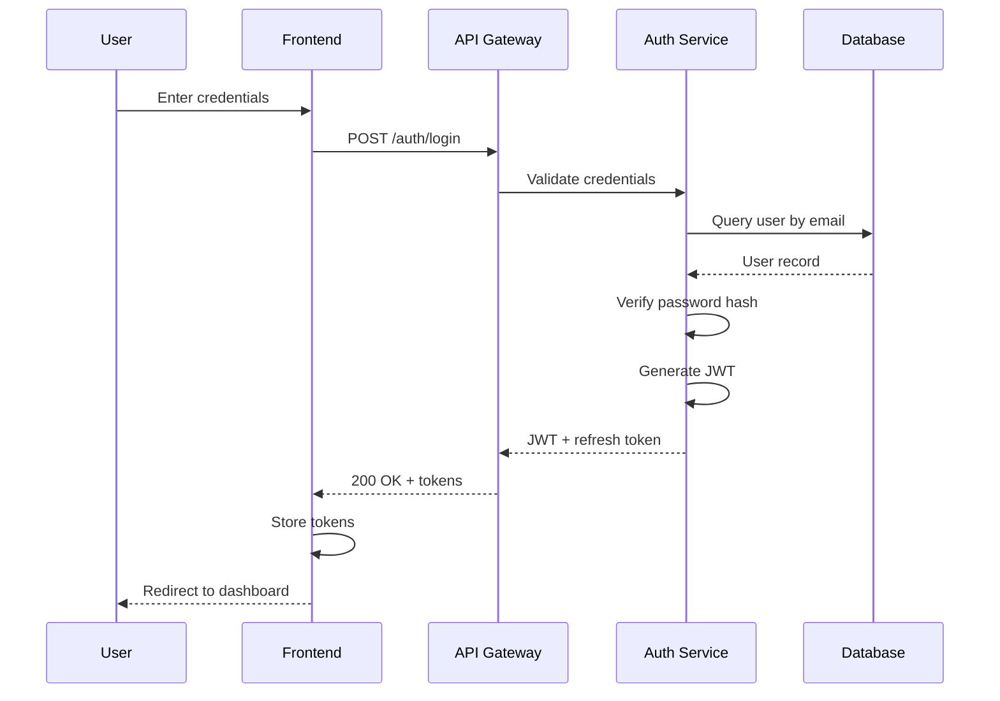

# Design Patterns

This reference covers the standard patterns for writing `design.md` — the technical design document produced during the Design phase of the spec workflow. A well-structured design document translates requirements into concrete architecture, components, data models, and API contracts before any code is written.

Use this page when creating or reviewing a spec's design document. Each section below corresponds to a part of the design document you should produce.

---

## Architecture Documentation

### Component Diagrams

Illustrate how major parts of the system relate to each other. Use ASCII art for simplicity or Mermaid for richer rendering.

**ASCII component diagram:**

```
┌─────────────────────────────────────────────────────────┐
│                      Frontend                            │
│  ┌──────────┐  ┌──────────┐  ┌──────────┐              │
│  │   Auth   │  │ Dashboard │  │ Settings │              │
│  └────┬─────┘  └────┬─────┘  └────┬─────┘              │
│       └─────────────┼─────────────┘                      │
└─────────────────────┼────────────────────────────────────┘
                      │ HTTP/REST
┌─────────────────────┼────────────────────────────────────┐
│                     │           API Gateway              │
│              ┌──────┴──────┐                             │
│              │   Router    │                             │
│              └──────┬──────┘                             │
│       ┌─────────────┼─────────────┐                      │
│  ┌────┴────┐  ┌────┴────┐  ┌────┴────┐                 │
│  │Auth Svc │  │User Svc │  │Data Svc │                 │
│  └────┬────┘  └────┬────┘  └────┬────┘                 │
└───────┼────────────┼────────────┼────────────────────────┘
        │            │            │
┌───────┼────────────┼────────────┼────────────────────────┐
│  ┌────┴────┐  ┌────┴────┐  ┌────┴────┐  Data Layer      │
│  │  Redis  │  │PostgreSQL│  │   S3   │                 │
│  └─────────┘  └─────────┘  └─────────┘                 │
└──────────────────────────────────────────────────────────┘
```

### Data Flow Diagrams

Show how data moves through the system for a key user action. Pair this with the component diagram to give a dynamic view of the architecture.

```
User Input → Validation → Processing → Storage → Response

[Browser] --POST /api/users--> [API Gateway]
    [API Gateway] --validate--> [Auth Service]
    [Auth Service] --JWT--> [API Gateway]
    [API Gateway] --create--> [User Service]
    [User Service] --INSERT--> [PostgreSQL]
    [PostgreSQL] --user_id--> [User Service]
    [User Service] --user object--> [API Gateway]
[API Gateway] --201 Created--> [Browser]
```

---

## Component Specification

For each component in the architecture diagram, write a specification using this template:

```markdown
### ComponentName

**Purpose**: One-sentence description of why this component exists

**Responsibilities**:
- Primary responsibility
- Secondary responsibility
- What it owns/manages

**Interfaces**:
- **Input**: What data/events it receives
- **Output**: What data/events it produces
- **Dependencies**: Other components it relies on

**Internal Structure** (if complex):
- Subcomponent A - purpose
- Subcomponent B - purpose

**State Management**:
- What state it maintains
- How state is persisted (if applicable)

**Error Handling**:
- How it handles failures
- Retry strategies
- Fallback behavior
```

The most important fields are **Purpose** and **Error Handling**. Components without a clear single purpose are often a sign that the design needs further decomposition.

---

## Data Model Documentation

### Entity Definition

For each data entity, document its fields, relationships, indexes, and constraints.

```markdown
### User

**Purpose**: Represents a registered user in the system

**Fields**:
| Field | Type | Constraints | Description |
|-------|------|-------------|-------------|
| id | UUID | PK, auto-generated | Unique identifier |
| email | string | unique, not null | User's email address |
| password_hash | string | not null | Bcrypt hash of password |
| created_at | timestamp | not null, default now | Creation time |
| updated_at | timestamp | not null | Last modification time |
| deleted_at | timestamp | nullable | Soft delete marker |

**Relationships**:
- Has many: Sessions, AuditLogs
- Belongs to: Organization (optional)

**Indexes**:
- email (unique)
- created_at (for sorting)
- organization_id (for filtering)

**Constraints**:
- Email must be valid format
- Password hash must be 60 characters (bcrypt)
```

### Type Definitions

Complement the entity table with concrete type definitions in the target language. These become the source of truth for implementation.

```typescript
interface User {
  id: string;           // UUID v4
  email: string;        // Valid email format
  passwordHash: string; // Bcrypt hash
  createdAt: Date;
  updatedAt: Date;
  deletedAt?: Date;     // Soft delete
}

interface CreateUserRequest {
  email: string;
  password: string;     // Min 8 chars, 1 upper, 1 number
}

interface UserResponse {
  id: string;
  email: string;
  createdAt: string;    // ISO 8601
}
```

Separate request/response types from storage types. This makes it explicit what data crosses API boundaries versus what stays internal.

---

## API Design Documentation

Document every endpoint the system exposes. Include the full request and response contract so that frontend and backend can be developed in parallel.

```markdown
### Create User

**Method**: POST
**Path**: /api/v1/users
**Authentication**: None (public endpoint)

**Request Headers**:
| Header | Required | Description |
|--------|----------|-------------|
| Content-Type | Yes | Must be application/json |

**Request Body**:
```json
{
  "email": "user@example.com",
  "password": "SecurePass123"
}
```

**Validation**:
- email: Required, valid email format, max 255 chars
- password: Required, min 8 chars, 1 uppercase, 1 number

**Success Response** (201 Created):
```json
{
  "id": "550e8400-e29b-41d4-a716-446655440000",
  "email": "user@example.com",
  "createdAt": "2024-01-15T10:30:00Z"
}
```

**Error Responses**:
| Status | Code | Description |
|--------|------|-------------|
| 400 | VALIDATION_ERROR | Invalid input data |
| 409 | EMAIL_EXISTS | Email already registered |
| 500 | INTERNAL_ERROR | Server error |

**Error Body**:
```json
{
  "error": {
    "code": "VALIDATION_ERROR",
    "message": "Invalid email format",
    "details": [
      { "field": "email", "message": "Must be a valid email" }
    ]
  }
}
```
```

Document error responses as carefully as success responses. Incomplete error contracts are a common source of integration bugs.

---

## Sequence Diagrams

Sequence diagrams show the temporal order of interactions between components. Use them for multi-step flows like authentication, checkout, or data pipelines.

### Mermaid Format



### ASCII Format

For environments where Mermaid is not rendered:

```
User          Frontend       API Gateway    Auth Service   Database
 │               │               │               │            │
 │──credentials─>│               │               │            │
 │               │──POST /login─>│               │            │
 │               │               │──validate────>│            │
 │               │               │               │──query────>│
 │               │               │               │<──user─────│
 │               │               │<──JWT─────────│            │
 │               │<──200 + JWT───│               │            │
 │<──redirect────│               │               │            │
```

---

## Security Considerations

Every design document should include a security section. Use this template:

```markdown
## Security Considerations

### Authentication
- Method: JWT with RS256 signing
- Token expiry: 15 minutes (access), 7 days (refresh)
- Storage: HttpOnly cookies (refresh), memory (access)

### Authorization
- Model: Role-based access control (RBAC)
- Roles: admin, user, guest
- Permission checks at API gateway level

### Data Protection
- Encryption at rest: AES-256
- Encryption in transit: TLS 1.3
- PII handling: Anonymized in logs

### Input Validation
- All inputs sanitized against XSS
- SQL injection prevented via parameterized queries
- File uploads scanned for malware

### Rate Limiting
- API: 100 requests/minute per IP
- Auth endpoints: 5 requests/minute per IP
- WebSocket: 50 messages/second per connection
```

If any of these sections do not apply, state that explicitly rather than omitting the section. An empty security section is a warning sign; a statement like "Authentication: not required — internal tool only" is not.

---

## Performance Considerations

Document performance targets and the strategies that will meet them:

```markdown
## Performance Considerations

### Targets
- API response time: < 200ms (p95)
- Page load time: < 2s (first contentful paint)
- Database queries: < 50ms

### Caching Strategy
- Static assets: CDN with 1-year cache
- API responses: Redis with 5-minute TTL
- Database: Query result caching

### Scalability
- Horizontal scaling: Stateless services behind load balancer
- Database: Read replicas for query distribution
- Background jobs: Queue-based processing

### Monitoring
- APM: Response times, error rates, throughput
- Database: Query performance, connection pool
- Infrastructure: CPU, memory, disk I/O
```

---

## Alternatives Considered

Documenting rejected alternatives is as important as documenting the chosen approach. It prevents re-litigating settled decisions and helps future engineers understand why the system is built the way it is.

```markdown
## Alternatives Considered

### Alternative 1: [Name]

**Description**: Brief description of the alternative

**Pros**:
- Advantage 1
- Advantage 2

**Cons**:
- Disadvantage 1
- Disadvantage 2

**Decision**: Not chosen because [specific reason]

### Alternative 2: [Name]

**Description**: Brief description

**Pros**:
- Advantage 1

**Cons**:
- Disadvantage 1

**Decision**: Not chosen because [specific reason]
```

A good alternatives section has two to four entries. Fewer suggests the design space was not fully explored; more suggests the decision is still open.
