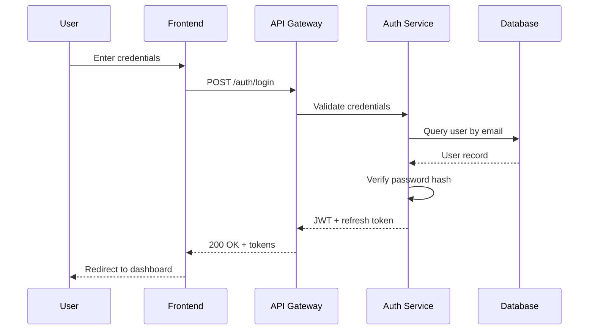

# Design

The design phase defines how the system will implement the requirements. It follows immediately after requirements in the `/spec` workflow, handled by the same spec-planner agent (opus tier).

## What goes in design.md

A complete design document covers six areas:

### 1. Architecture overview

A high-level view of the major components and how they relate. Use ASCII or Mermaid diagrams:

```
Frontend -> API Gateway -> Services -> Data Layer
```

### 2. Data flow

How data moves through the system from input to output. Shows request paths, transformations, and storage interactions.

### 3. Component specifications

For each major component:

- **Purpose** — one-sentence description of why it exists
- **Responsibilities** — what it owns and manages
- **Interfaces** — inputs, outputs, dependencies
- **Error handling** — failures, retries, fallback behavior

### 4. Data models

Entity definitions with fields, types, constraints, relationships, and indexes. Type definitions in the target language.

### 5. API design

Endpoint specifications including method, path, authentication requirements, request/response formats, and error responses.

### 6. Sequence diagrams

Key interaction flows using Mermaid or ASCII format. Particularly useful for multi-step operations like authentication, payment processing, or webhook handling.

## Additional sections

The design should also include:

- **Security considerations** — authentication method, authorization model, data protection, input validation, rate limiting
- **Performance considerations** — response time targets, caching strategy, scalability approach, monitoring
- **Alternatives considered** — other approaches evaluated and why they were not chosen

## Design phase workflow

The spec-planner follows this sequence:

1. Review all requirements from Phase 1
2. Identify major components needed to satisfy the requirements
3. Define interfaces between components
4. Design data models and storage
5. Plan API contracts where applicable
6. Document security and performance considerations
7. List alternatives considered with rationale

## Refinement

Use `/spec-refine` to update the design after the initial spec. When the design changes, run `/spec-tasks` to regenerate tasks from the updated design.

The spec-validator checks that the design addresses all requirements — no requirement should be left without a corresponding design element.

## Sequence diagram example


